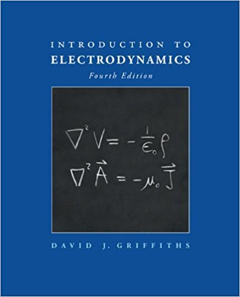
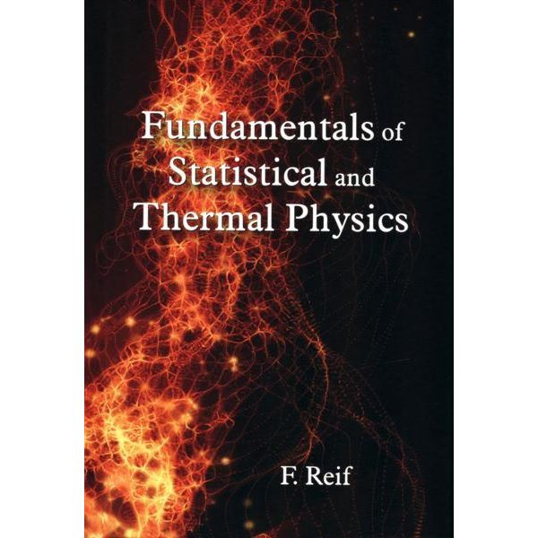

#### <u>Introduction to Electrodynamics I (Instructor: Dr.Langari)</u>

[Teacher Assistant Winter 2019]("https://physics.sharif.edu/~spin/courses/")

 
 
#### <u>Introduction to Electrodynamics II (Instructor: Dr.Langari)</u>

[Teacher Assistant Winter 2020]("https://physics.sharif.edu/~spin/courses/")
 
 
 
 

    
#### <u>Fundamentals of Statistical and Thermal Physics (Instructor: Dr.Moghimi)</u>

[Teacher Assistant Fall 2019]("https://sharif.edu/~samanimi")
 
 
 
 

			

<!--[click here for the most recent version of the paper]({{ BASE_PATH}}/pages/working_papers/sample-working-paper.pdf)-->

<!-- Note: this is how to write a comment in HTML. Everything in here won't show up on your webpage.-->

<!--
To increase the size of the title, use fewer # in front of the paper title.
To decrease the size of the title, use more #. 
To remove the italics, remove the * before and after the description
To remove the underline from the title, remove the <u> tags (<u> and </u>)
-->